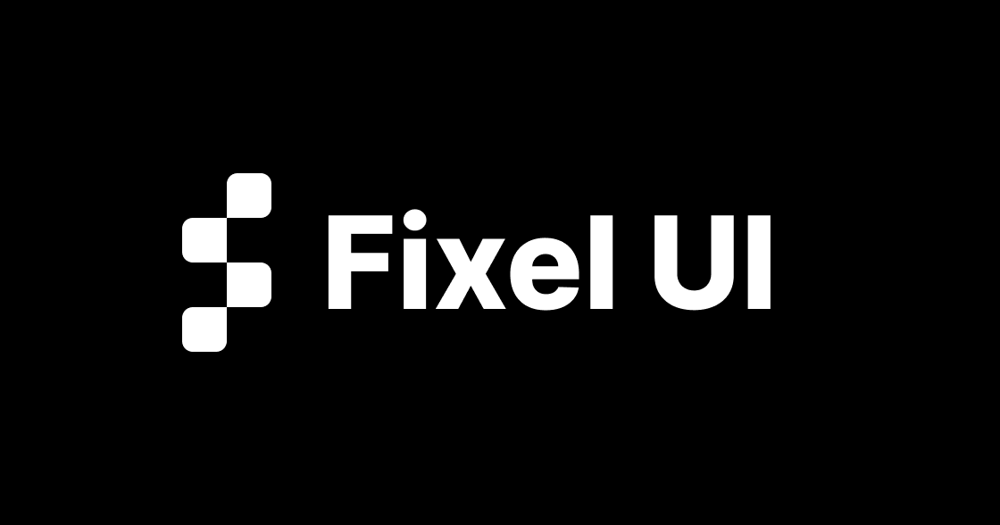

<p align="center">
  
</p>

<h1 align="center">Fixel UI</h1>

<p align="center">
  Open-source React components built with TypeScript, Tailwind CSS, and the shadcn CLI.<br/>
  Copy, install, customize — no lock-in, no heavy deps.
</p>

<p align="center">
  <a href="https://fixel-ui.vercel.app"><strong>🌐 Live Demo</strong></a> ·
  <a href="#-quick-install"><strong>⚡ Quick Install</strong></a> ·
  <a href="#-components"><strong>📦 Components</strong></a> ·
  <a href="./CONTRIBUTING.md"><strong>🤝 Contributing</strong></a>
</p>

<p align="center">
  
  
  
</p>

---

## ✨ About

**Fixel UI** is a shadcn-compatible component registry — a curated collection of production-ready UI blocks you can install directly into your project with one command.

No wrappers. No runtime overhead. You own the code.

---

## 🚀 Features

| Feature | Details |
|---|---|
| 🧩 **shadcn CLI** | Install any component with one `add` command |
| 🎨 **Tailwind CSS v4** | Utility-first styling, fully themeable |
| 🧠 **TypeScript-first** | Every component is typed |
| ✏️ **Open in v0** | Edit any component directly in v0.dev |
| 📋 **Copy & paste** | Works without the CLI too |
| ⚡ **No lock-in** | Components live in *your* project |
| 🌍 **Open-source** | MIT licensed |

---

## ⚡ Quick Install

Make sure you have a project with [shadcn](https://ui.shadcn.com/docs/installation) initialized, then run:

```bash
# pnpm (recommended)
pnpm dlx shadcn@latest add https://fixel-ui.vercel.app/r/<component-name>.json

# npm
npx shadcn@latest add https://fixel-ui.vercel.app/r/<component-name>.json

# yarn
yarn shadcn@latest add https://fixel-ui.vercel.app/r/<component-name>.json

# bun
bunx --bun shadcn@latest add https://fixel-ui.vercel.app/r/<component-name>.json
```

Replace `<component-name>` with any component listed below.

---

## 📦 Components

### Footers

| Name | Install URL |
|---|---|
| **Footer 01** — nav sections, social links, branding | [`/r/footer-01.json`](https://fixel-ui.vercel.app/r/footer-01.json) |
| **Footer 02** — logo watermark, social icons, glow accent | [`/r/footer-02.json`](https://fixel-ui.vercel.app/r/footer-02.json) |

> Install all footer variants at once:
> ```bash
> pnpm dlx shadcn@latest add https://fixel-ui.vercel.app/r/footer.json
> ```

---

## 🗂️ Project Structure

```
fixel-ui/
├── public/
│   └── r/                        # ← Generated registry JSON files (served publicly)
│       ├── footer-01.json
│       ├── footer-02.json
│       └── footer.json           # combined group
├── src/
│   ├── app/                      # Next.js App Router pages
│   ├── components/
│   │   ├── registry/
│   │   │   ├── blocks/           # Block components (multi-file page-level)
│   │   │   │   ├── footer-01/page.tsx
│   │   │   │   └── footer-02/page.tsx
│   │   │   └── ui/               # Primitive UI components (button, etc.)
│   │   └── site/                 # Internal site-only components
│   ├── constants/
│   │   └── site.ts               # baseUrl and other global constants
│   ├── registry/
│   │   ├── schema.ts             # TypeScript types for registry items
│   │   ├── footer.ts             # Footer registry definitions
│   │   └── index.ts              # Aggregates all registry items
│   └── scripts/
│       └── build-registry.ts     # Generates public/r/*.json
├── registry.json                 # shadcn CLI registry manifest
└── CONTRIBUTING.md
```

---

## 🛠️ Local Development

```bash
# 1 — clone
git clone https://github.com/FadyEmad01/fixel-ui.git
cd fixel-ui

# 2 — install dependencies
pnpm install

# 3 — start dev server
pnpm dev
```

Open [http://localhost:3000](http://localhost:3000) to see the component showcase.

### Regenerate the registry JSON

After adding or editing components, rebuild the registry:

```bash
pnpm registry:generate
```

This reads all component sources and writes fresh `public/r/*.json` files.

---

## 🤝 Contributing

We welcome contributions of all kinds — new components, bug fixes, docs improvements, and more.

👉 Read the full guide: **[CONTRIBUTING.md](./CONTRIBUTING.md)**

---

## 📄 License

[MIT](./LICENSE) © Fixel UI
